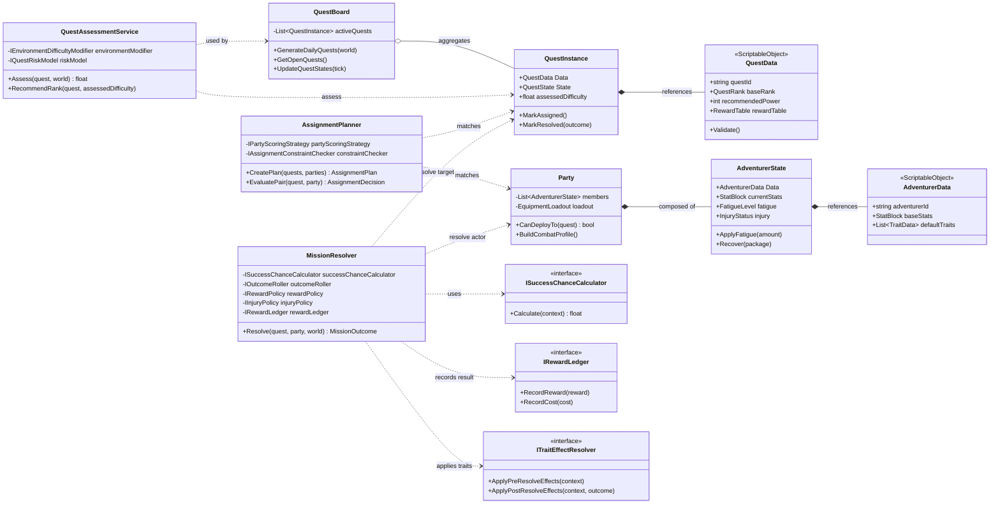

# 단계 2: 클래스 다이어그램 및 구조 설계 (핵심 루프 A+B+C)

## 설계 원칙 반영
- **Unity 엔진 적합성**: 데이터는 `ScriptableObject`, 실행 흐름/오케스트레이션은 서비스 클래스로 분리
- **SRP 준수**: `Quest`는 데이터만 보유하고, 성공/실패 계산은 `MissionResolver`와 전략 인터페이스가 담당
- **확장성(OCP 지향)**: 결과 계산식/특수 능력/환경 보정식을 인터페이스로 추상화해 교체 가능

---

## 1) 시스템 A (Quest) 구조

### 1-1. `QuestData` (ScriptableObject)
> 퀘스트 정적 데이터 정의 (런타임 계산 로직 없음)

**주요 멤버 변수**
- `string questId`
- `string displayName`
- `QuestCategory category`
- `QuestRank baseRank`
- `int recommendedPower`
- `RewardTable rewardTable`
- `LocationProfileData locationProfile`
- `int timeLimitDays`

**주요 메서드**
- `Validate()` : 에디터/로딩 시 데이터 무결성 체크

### 1-2. `QuestInstance` (Plain C# Model)
> 당일 생성된 실제 퀘스트 오브젝트(동적 상태 포함)

**주요 멤버 변수**
- `QuestData Data`
- `QuestState State`
- `int urgency`
- `float assessedDifficulty`
- `EnvironmentContextSnapshot contextSnapshot`

**주요 메서드**
- `MarkAssigned()`
- `MarkResolved(MissionOutcome outcome)`

### 1-3. `QuestBoard` (Service)
> 퀘스트 목록과 상태 전이 관리

**주요 멤버 변수**
- `List<QuestInstance> activeQuests`
- `IQuestFactory questFactory`
- `IQuestLifecyclePolicy lifecyclePolicy`

**주요 메서드**
- `GenerateDailyQuests(WorldStateSnapshot world)`
- `IReadOnlyList<QuestInstance> GetOpenQuests()`
- `UpdateQuestStates(DayTick tick)`

### 1-4. `QuestAssessmentService` (Service)
> 환경 변수 반영 난이도 보정

**주요 멤버 변수**
- `IEnvironmentDifficultyModifier environmentModifier`
- `IQuestRiskModel riskModel`

**주요 메서드**
- `float Assess(QuestInstance quest, WorldStateSnapshot world)`
- `QuestRank RecommendRank(QuestInstance quest, float assessedDifficulty)`

---

## 2) 시스템 B (Adventurer) 구조

### 2-1. `AdventurerData` (ScriptableObject)
> 모험가 원본 정의 데이터

**주요 멤버 변수**
- `string adventurerId`
- `string name`
- `RoleType baseRole`
- `StatBlock baseStats`
- `List<TraitData> defaultTraits`

**주요 메서드**
- `Validate()`

### 2-2. `AdventurerState` (Plain C# Model)
> 런타임 상태(체력/피로/부상/경험)

**주요 멤버 변수**
- `AdventurerData Data`
- `StatBlock currentStats`
- `FatigueLevel fatigue`
- `InjuryStatus injury`
- `List<TraitRuntime> traits`

**주요 메서드**
- `ApplyFatigue(int amount)`
- `ApplyInjury(InjuryInfo info)`
- `Recover(RecoveryPackage package)`

### 2-3. `Party` (Aggregate Root)
> 퀘스트에 배치되는 팀 단위

**주요 멤버 변수**
- `List<AdventurerState> members`
- `PartyFormation formation`
- `EquipmentLoadout loadout`

**주요 메서드**
- `bool CanDeployTo(QuestInstance quest)`
- `CombatProfile BuildCombatProfile()`
- `SupportProfile BuildSupportProfile()`

### 2-4. `ITraitEffectResolver` (Interface)
> 특수 능력 확장 포인트

**주요 메서드**
- `void ApplyPreResolveEffects(ResolveContext context)`
- `void ApplyPostResolveEffects(ResolveContext context, MissionOutcome outcome)`

---

## 3) 시스템 C (Resolution) 구조

### 3-1. `AssignmentPlanner` (Service)
> 퀘스트-파티 매칭

**주요 멤버 변수**
- `IPartyScoringStrategy partyScoringStrategy`
- `IAssignmentConstraintChecker constraintChecker`

**주요 메서드**
- `AssignmentPlan CreatePlan(IReadOnlyList<QuestInstance> quests, IReadOnlyList<Party> parties)`
- `AssignmentDecision EvaluatePair(QuestInstance quest, Party party)`

### 3-2. `MissionResolver` (Service)
> 결과 계산 오케스트레이션

**주요 멤버 변수**
- `ISuccessChanceCalculator successChanceCalculator`
- `IOutcomeRoller outcomeRoller`
- `IRewardPolicy rewardPolicy`
- `IInjuryPolicy injuryPolicy`
- `IRewardLedger rewardLedger`

**주요 메서드**
- `MissionOutcome Resolve(QuestInstance quest, Party party, WorldStateSnapshot world)`

### 3-3. 결과 계산 인터페이스

#### `ISuccessChanceCalculator`
- `float Calculate(ResolveContext context)`

#### `IOutcomeRoller`
- `OutcomeGrade Roll(float successChance, ResolveContext context)`

#### `IRewardPolicy`
- `RewardPackage BuildRewards(ResolveContext context, OutcomeGrade grade)`

#### `IInjuryPolicy`
- `InjuryPackage BuildInjuries(ResolveContext context, OutcomeGrade grade)`

---

## 4) 클래스 관계 정의

### Composition
- `QuestInstance` **composes** `QuestData` 참조 + 컨텍스트 스냅샷
- `Party` **composes** `AdventurerState` 컬렉션 + 장비 로드아웃
- `MissionResolver` **composes** 여러 정책 인터페이스 구현체

### Aggregation
- `QuestBoard` **aggregates** 다수의 `QuestInstance`
- `AssignmentPlanner`는 `QuestInstance`, `Party`를 입력 집합으로 받아 매칭만 수행(소유하지 않음)

### Inheritance / Interface Realization
- `QuestData`, `AdventurerData`, `TraitData`는 `ScriptableObject` 기반 에셋
- 결과 계산/특성 처리/제약 검증은 인터페이스 구현체 교체로 확장

---

## 5) DI / Observer 패턴 적용 지점

### DI가 필요한 지점
- `QuestAssessmentService`: 환경 보정 모델 교체를 위해 DI 필요
- `AssignmentPlanner`: 매칭 전략과 제약 정책 분리 위해 DI 필요
- `MissionResolver`: 성공률/보상/부상 계산식 교체 위해 DI 필수
- `RewardLedger`: 전역 정적 접근보다 `IRewardLedger` DI 권장

### Observer(Event Bus) 권장 지점
- `MissionResolver.Resolve()` 완료 시 `OnMissionResolved` 이벤트 발행
- `QuestBoard`, `AdventurerRoster`, `NotificationLog`, `ReputationSystem`이 구독
- 이유: 해상도 높은 후처리(평판/로그/UI 갱신)를 느슨하게 결합

---

## 6) RewardLedger 설계 결정

### 결론: **싱글톤/정적보다 DI 방식 권장**
- 테스트성: 모의(Mock) `IRewardLedger` 주입 가능
- 멀티 모드 대응: 100일 모드/무한 모드별 ledger 정책 분기 쉬움
- 결합도 감소: 도메인 서비스가 전역 상태에 직접 접근하지 않음

> 권장 구현: `RewardLedgerService : IRewardLedger`를 게임 세션 스코프(하루/세션 단위)로 생성해 주입

---

## 7) Unity 컴포넌트 분류 (MonoBehaviour 상속 여부)

### MonoBehaviour 권장
- `GameLoopController` (씬 생명주기 진입점)
- `QuestBoardPresenter` (UI 바인딩)
- `MissionResultPresenter` (UI 표시)

### MonoBehaviour 비권장 (Plain C#)
- `QuestBoard`, `QuestAssessmentService`, `AssignmentPlanner`, `MissionResolver`
- 모든 계산 전략 인터페이스 및 정책 클래스
- 이유: 테스트 편의성, 런타임 독립성, 도메인 순수성 유지

### ScriptableObject 권장
- `QuestData`, `AdventurerData`, `TraitData`, `LocationProfileData`, `RewardTable`

---

## 8) Mermaid UML 클래스 다이어그램

---

## 9) Quest - Party - MissionResolver 상호작용 요약
1. `AssignmentPlanner`가 `QuestInstance`와 `Party` 후보를 평가해 매칭안 생성
2. `MissionResolver`가 매칭된 쌍을 받아 `ResolveContext` 구성
3. `ISuccessChanceCalculator`와 `ITraitEffectResolver`를 통해 성공률/보정치 계산
4. `IOutcomeRoller`로 결과 등급 확정 후 `IRewardPolicy`/`IInjuryPolicy` 적용
5. `IRewardLedger`에 결과 반영, 이후 이벤트 발행으로 후속 시스템 갱신
