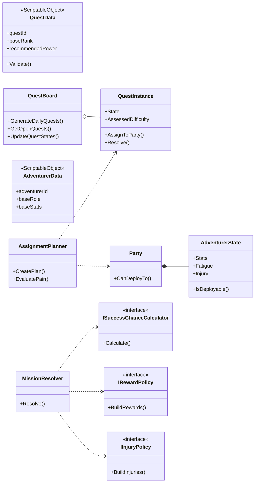

# 클래스 다이어그램 및 구조 설계 가이드

`docs/core-loop-class-architecture.md`를 기준으로, 실제 구현 전에 팀이 동일한 방식으로 UML과 구조를 설계할 수 있도록 **절차 중심 가이드**를 정리한다.

---

## 1) 설계 시작 전 원칙 고정

1. **Unity 분리 원칙**
   - 정적 데이터: `ScriptableObject` (`QuestData`, `AdventurerData`, `TraitData`, `RewardTable`)
   - 런타임 상태: Plain C# (`QuestInstance`, `AdventurerState`, `Party`)
   - 흐름/계산: 서비스 (`QuestBoard`, `QuestAssessmentService`, `AssignmentPlanner`, `MissionResolver`)

2. **SRP 적용 체크**
   - `QuestData/QuestInstance`는 계산식을 갖지 않는다.
   - 성공률/보상/부상 계산은 `MissionResolver` + 정책 인터페이스가 담당한다.

3. **확장성(OCP) 전제**
   - 계산 로직은 인터페이스(`ISuccessChanceCalculator`, `IRewardPolicy`, `IInjuryPolicy`)로 교체 가능하게 설계한다.

---

## 2) 클래스 다이어그램 작성 순서

### Step A. 도메인 축 먼저 배치
다이어그램의 중심을 다음 3축으로 둔다.
- **Quest 축**: `QuestData` → `QuestInstance` → `QuestBoard`
- **Adventurer 축**: `AdventurerData` → `AdventurerState` → `Party`
- **Resolution 축**: `AssignmentPlanner` → `MissionResolver` → 결과 DTO

### Step B. 관계 타입을 먼저 확정
- Composition: `Party *-- AdventurerState`
- Aggregation: `QuestBoard o-- QuestInstance`
- Dependency: `MissionResolver ..> ISuccessChanceCalculator` 등
- Realization: `MissionResolver ..|> IMissionResolver`

### Step C. 인터페이스 레이어 분리
`MissionResolver` 주변 인터페이스를 "정책 계층"으로 묶어서 표기
- `ISuccessChanceCalculator`
- `IOutcomeRoller`
- `IRewardPolicy`
- `IInjuryPolicy`
- `ITraitEffectResolver`

### Step D. 주입 방향 명시
- 화살표는 **구현체 → 인터페이스**가 아니라 **소비자 클래스 → 인터페이스**로 표시
- 생성자 주입 대상은 note로 함께 표기

---

## 3) 구조 설계(패키지/폴더) 방법

```text
Runtime/
  GameDesign/
    Data/      # ScriptableObject 정의
      QuestData.cs
      AdventurerData.cs
    Domain/    # Plain C# 상태/값 객체
      QuestInstance.cs
      AdventurerState.cs
      GameDomainTypes.cs
    Services/  # 오케스트레이션 및 계산 서비스
      QuestBoard.cs
      QuestAssessmentService.cs
      AssignmentPlanner.cs
      MissionResolver.cs
    Policies/  # 인터페이스 구현체(규칙 교체 가능)
      SuccessChance/
      Reward/
      Injury/
```

구조 설계 시 핵심:
- `Data`는 Unity Inspector 친화적으로 유지
- `Domain`은 Unity API 의존 최소화
- `Services`는 상태 변경의 진입점
- `Policies`는 교체 가능한 규칙 모음

---

## 4) 클래스별 설계 포인트 (무엇을 다이어그램에 반드시 넣을지)

### 4-1. Quest 계열
- `QuestData`: ID, 랭크, 추천전투력, 보상테이블, 지역프로필
- `QuestInstance`: 상태(State), 평가난이도, 배정파티ID, 결과
- `QuestBoard`: 생성/조회/상태갱신 메서드
- `QuestAssessmentService`: `Assess()`, `RecommendRank()`

### 4-2. Adventurer 계열
- `AdventurerData`: 기본역할, 기본스탯, 기본특성
- `AdventurerState`: 현재스탯, 피로, 부상, 배치가능 여부
- `Party`: 멤버 컬렉션 + 배치 가능성 검증

### 4-3. Resolution 계열
- `AssignmentPlanner`: 퀘스트-파티 매칭
- `MissionResolver`: 결과 계산 오케스트레이션
- 인터페이스 군: 성공률/결과롤/보상/부상/특성효과

---

## 5) DI/Observer를 다이어그램에 반영하는 방법

### DI 반영
- `MissionResolver` 클래스에 생성자 시그니처 note 추가
- 인터페이스와 dependency 화살표를 모두 표기
- `IRewardLedger`는 전역 싱글톤이 아니라 주입되는 협력자로 명시

### Observer 반영
- 클래스 다이어그램에 `EventBus`를 직접 크게 넣기보다, 별도 컴포넌트 다이어그램/시퀀스에서 표현
- 최소 표기:
  - `MissionResolver` → `MissionResolvedEvent` 발행
  - `NotificationLog`/UI Presenter 구독

---

## 6) 설계 검토 체크리스트

- [ ] `ScriptableObject`와 Plain C#의 경계가 명확한가?
- [ ] `QuestInstance`가 계산 로직을 직접 가지지 않는가?
- [ ] `MissionResolver`가 구체 구현이 아닌 인터페이스에 의존하는가?
- [ ] `AssignmentPlanner`가 소유가 아닌 매칭 책임만 가지는가?
- [ ] 향후 새 계산 방식 추가 시 기존 클래스 수정 없이 확장 가능한가?
- [ ] UI 갱신이 도메인 직접 호출이 아닌 이벤트 기반으로 연결되는가?

---

## 7) Mermaid 템플릿 (팀 공용 초안)



이 템플릿에 팀별 구현 클래스만 추가하면, 구조 일관성을 유지한 채 빠르게 상세화할 수 있다.
