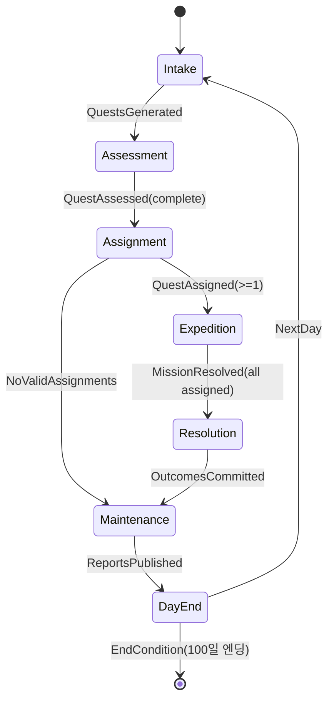
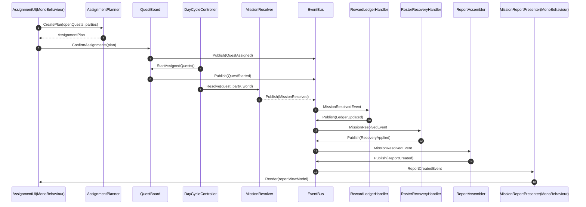

# 단계 3: 상호작용(Interaction) 및 시간 흐름(Time Flow) 설계

> 초점: 개별 클래스 내부 구현이 아니라, 시스템 간 신호 교환과 하루 진행 중 데이터 전이를 명확히 정의한다.

## 1) 하루 흐름(Day Cycle) 데이터 전이

### Day Cycle 단계
1. **접수 (Intake)**
2. **평가 (Assessment)**
3. **배정 (Assignment)**
4. **원정 (Expedition/InProgress)**
5. **결과 (Resolution)**
6. **정비 (Maintenance)**

### 단계별 입력/출력/신호

| 단계 | 주요 입력 데이터 | 처리 주체 | 주요 출력 데이터 | 발행 이벤트 |
|---|---|---|---|---|
| Intake | `WorldStateSnapshot`, 전일 `Reputation`, 지역/사건 플래그 | `QuestBoard`, `IQuestFactory` | `QuestInstance(Pending)` 목록 | `DayPhaseStarted(Intake)`, `QuestsGenerated` |
| Assessment | `QuestInstance(Pending)`, 환경 컨텍스트 | `QuestAssessmentService` | `assessedDifficulty`, 추천 랭크 | `QuestAssessed` |
| Assignment | 평가 완료 퀘스트, `Party` 풀, 제약조건 | `AssignmentPlanner` | `AssignmentPlan`, 대상 퀘스트 `Assigned` | `AssignmentsPlanned`, `QuestAssigned` |
| Expedition | `Assigned` 퀘스트와 파티 매칭 | `DayCycleController`(스케줄), `MissionResolver` 트리거 | 퀘스트 `InProgress` 진입 | `QuestStarted` |
| Resolution | `ResolveContext(Quest+Party+World)` | `MissionResolver` + 정책 인터페이스 | `MissionOutcome`, 보상/부상 패키지, 퀘스트 `Resolved` | `MissionResolved` |
| Maintenance | 결과 패키지, 길드 자원 상태 | `IRewardLedger`, `InjuryRecoverySystem`, `NotificationLog` | 자원 반영, 회복 갱신, 보고서 데이터, 일부 `Archived` | `LedgerUpdated`, `RecoveryApplied`, `ReportCreated`, `DayClosed` |

---

## 2) 퀘스트 라이프사이클

### 상태 정의
- **Pending**: 접수 및 생성 완료, 아직 배정 전
- **Assigned**: 파티가 배정되어 출발 대기
- **InProgress**: 원정 수행 중
- **Resolved**: 성공/실패/중단 포함 결과 확정
- **Archived**: 후처리까지 종료되어 보관 상태

### 상태 전이도 (State Transition Table)

| 현재 상태 | 트리거(이벤트/조건) | 다음 상태 | 전이 책임자 | 비고 |
|---|---|---|---|---|
| Pending | `AssignmentPlanner`가 유효 매칭 생성 | Assigned | `QuestBoard` | 파티 중복 배정/제약 검증 통과 필요 |
| Pending | 당일 마감 시간 초과, 자동 종료 정책 | Archived | `QuestBoard` + `IQuestLifecyclePolicy` | 미배정 만료 퀘스트 |
| Assigned | 출발 시각 도달 + 파티 가용 | InProgress | `DayCycleController` | 출발 직전 취소 가능 |
| Assigned | 파티 상태 악화/자원 부족으로 취소 | Pending | `QuestBoard` | 재배정 가능 |
| InProgress | `MissionResolver.Resolve()` 완료 | Resolved | `MissionResolver` | 결과 등급 포함 |
| InProgress | 강제 중단(이벤트/철수) | Resolved | `MissionResolver` | 실패 혹은 부분성공 처리 |
| Resolved | 보상/부상/로그 후처리 완료 | Archived | `DayCycleController` | 보고서 생성까지 끝난 상태 |
| Archived | 재오픈 정책(특수 이벤트) | Pending | `EventManager` + `QuestBoard` | 일반적으로 비활성, 예외 흐름 |

---

## 3) UI 갱신 흐름 (Observer 패턴 중심)

### 핵심 목표
`MissionResolver`가 결과를 확정하면, 도메인 로직이 UI를 직접 호출하지 않고 이벤트를 발행하고, UI/리포트 계층이 이를 구독해 화면을 갱신한다.

### 이벤트 파이프라인
1. `MissionResolver.Resolve()`가 `MissionOutcome` 생성
2. `EventBus.Publish(MissionResolved)` 발행 (payload: questId, partyId, outcomeGrade, rewards, injuries)
3. 구독자 동작
   - `RewardLedgerHandler`: 보상/비용 반영 후 `LedgerUpdated` 발행
   - `RosterRecoveryHandler`: 부상/피로 반영 후 `RecoveryApplied` 발행
   - `QuestBoardHandler`: 상태를 `Resolved`로 확정
   - `ReportAssembler`: 보고서 ViewModel 생성 후 `ReportCreated` 발행
4. `MissionReportPresenter(MonoBehaviour)`가 `ReportCreated` 수신
5. UI 바인딩(`MissionReportView`) 갱신 + 알림 패널(`NotificationLog`) 반영

### Observer 설계 포인트
- 이벤트 payload는 **불변 DTO** 사용 (`MissionResolvedEvent`)
- UI는 `ReportCreated`만 구독하고, 도메인 이벤트 세부사항에는 직접 의존하지 않음
- 재실행/리플레이를 위해 이벤트에 `dayIndex`, `sequenceNo`, `timestamp` 포함 권장

---

## 4) 주요 이벤트 리스트

| 이벤트명 | 발행자 | 주요 Payload | 구독자 |
|---|---|---|---|
| `DayPhaseStarted` | `DayCycleController` | dayIndex, phase | UI 진행바, 로그 |
| `QuestsGenerated` | `QuestBoard` | questIds | QuestBoard UI |
| `QuestAssessed` | `QuestAssessmentService` | questId, assessedDifficulty, recommendedRank | Assignment 화면 |
| `QuestAssigned` | `QuestBoard` | questId, partyId | 파티/퀘스트 패널 |
| `QuestStarted` | `DayCycleController` | questId, partyId, startTime | 진행 현황 UI |
| `MissionResolved` | `MissionResolver` | outcome, rewards, injuries | Ledger/Recovery/Report 파이프라인 |
| `LedgerUpdated` | `RewardLedgerHandler` | deltaGold, items | 자원 UI |
| `RecoveryApplied` | `RosterRecoveryHandler` | adventurerStatusChanges | 모험가 UI |
| `ReportCreated` | `ReportAssembler` | reportViewModel | 보고서 UI |
| `DayClosed` | `DayCycleController` | daySummary | 일일 요약/다음날 버튼 |

---

## 5) 하루 일과 상태 다이어그램 (State Machine Diagram)

---

## 6) 퀘스트 배정~결과 보고서 시퀀스 다이어그램 (Sequence Diagram)

---

## 7) 구현 시 체크리스트 (상호작용 중심)
- `DayCycleController`는 상태 전환과 이벤트 발행만 담당(도메인 계산 금지)
- `MissionResolver`는 결과 계산 및 `MissionResolved` 발행까지만 담당(UI 호출 금지)
- `ReportAssembler`가 도메인 결과를 UI용 ViewModel로 변환
- 모든 phase 전환은 `DayPhaseStarted`/`DayClosed`로 추적 가능해야 함
- 퀘스트 상태 전이는 `QuestBoard` 단일 진입점으로 제한해 무결성 유지
