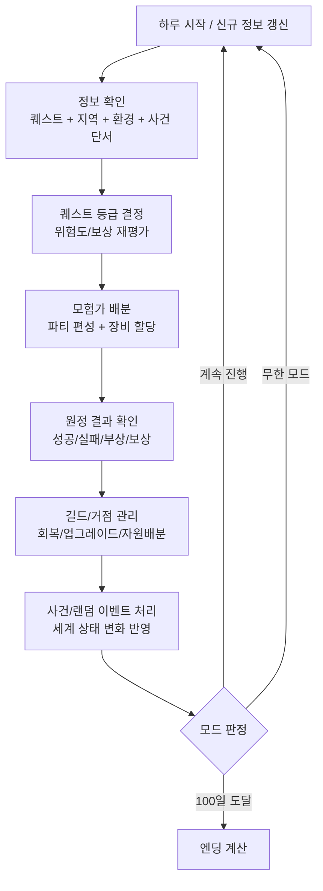

# 단계 1: 핵심 메커니즘 및 도메인 정의

## 1) 게임 컨셉 설명
**퀘스트 길드 시뮬레이션**은 플레이어가 전투 주체가 아니라, 길드의 **퀘스트 담당자(접수/분류/배정/사후관리자)**로서 운영 의사결정을 내리는 UI 중심 게임이다.  
핵심 재미는 "강한 캐릭터 조작"이 아니라 **정보 비대칭 상황에서의 판단**에 있다.

- 같은 퀘스트라도 평가 등급/파티 배분에 따라 결과가 크게 달라진다.
- 자원, 피로도, 명성, 사건 리스크를 동시에 관리해야 한다.
- 100일 엔딩 모드에서는 제한된 기간 내 최적화가 핵심이고, 무한 모드에서는 장기 운영 안정성이 핵심이 된다.

---

## 2) 핵심 플레이 루프 요약
1. **정보 확인**: 접수된 퀘스트/지역/환경/사건 단서 확인
2. **퀘스트 등급 결정**: 위험도와 보상 기준으로 내부 등급 산정/수정
3. **모험가 배분**: 가용 인원, 역할 조합, 컨디션, 장비를 고려해 파티 편성
4. **결과 확인**: 성공/실패, 부상, 보상, 후속 사건 반영
5. **길드/거점 관리**: 시설 업그레이드, 자원 배분, 인력 회복/채용
6. **사건/랜덤 이벤트 처리**: 세계 상태 및 선택 결과로 발생한 변수 대응
7. **다음 날 진행**: 새로운 접수/상황 갱신 후 반복

---

## 3) 주요 클래스 후보군 리스트
> 클래스명은 구현 언어와 무관하게 도메인 책임 기준으로 분리한 후보군.

- **GameSession**: 모드(100일/무한), 날짜, 전역 승패 상태를 관리
- **DayCycleController**: 하루 단계(접수→평가→배정→결과→정비) 진행 제어
- **QuestBoard**: 당일 접수 퀘스트 목록 제공 및 상태 전이 대기열 관리
- **Quest**: 퀘스트 기본 정보(목표/지역/제한시간/기본보상/기본위험도) 보유
- **QuestAssessmentService**: 단서/환경/사건 맥락을 반영해 실질 난이도(내부 등급) 계산
- **AssignmentPlanner**: 퀘스트별 파티 편성안 생성, 충돌(중복 배정/과로) 검증
- **Adventurer**: 스탯, 직군, 특성, 컨디션, 부상, 경험치 등 개인 상태 관리
- **AdventurerRoster**: 전체 모험가 풀(고용/이탈/대기/원정중) 관리
- **Party**: 역할군(탱/딜/지원/탐지 등) 조합과 시너지 값 표현
- **EquipmentInventory**: 장비/소모품/재료 보유량과 장착 상태 관리
- **MissionResolver**: 배정 결과를 확률/규칙 기반으로 시뮬레이션해 결과 산출
- **RewardLedger**: 골드, 재화, 평판, 아이템 획득/손실 내역 기록
- **InjuryRecoverySystem**: 부상/피로 회복 및 치료 자원 소모 처리
- **GuildHQ**: 길드 시설 레벨, 슬롯, 운영 보너스(회복속도/정보정확도 등) 관리
- **FacilityUpgradeService**: 거점 건물 업그레이드 조건/비용/효과 적용
- **ReputationSystem**: 지역/진영별 평판 변화 및 신규 퀘스트 해금 반영
- **EventManager**: 정적 사건(스토리) + 동적 랜덤 이벤트 발생 트리거 관리
- **WorldState**: 지역 위험도, 계절/날씨, 세력 관계 등 외부 환경 상태 보관
- **LocationProfile**: 지역별 특수 규칙(지형 보정, 출현 몬스터, 이동 페널티) 정의
- **NotificationLog**: 플레이어에게 노출할 보고서/경고/결과 메시지 축적
- **SaveLoadService**: 세션 저장/불러오기 및 모드별 메타 진행도 관리

---

## 4) 핵심 시스템 요약 (역할 + 연결관계)

### A. 퀘스트 시스템
- 구성: `QuestBoard`, `Quest`, `QuestAssessmentService`
- 역할: 퀘스트 생성/노출, 위험도 재평가, 우선순위 정렬
- 연결:
  - `WorldState`의 날씨/지역위험 데이터를 받아 난이도 보정
  - `ReputationSystem` 상태에 따라 고급 퀘스트가 해금

### B. 모험가 관리 시스템
- 구성: `Adventurer`, `AdventurerRoster`, `Party`, `InjuryRecoverySystem`
- 역할: 인력 상태 추적, 파티 시너지 구성, 부상/피로 관리
- 연결:
  - `AssignmentPlanner`에 가용 인력을 공급
  - `MissionResolver` 결과로 부상/경험치/이탈 상태 갱신

### C. 배정/결과 시스템
- 구성: `AssignmentPlanner`, `MissionResolver`, `RewardLedger`
- 역할: 배정 의사결정의 실제 성과를 계산하여 리소스로 환산
- 연결:
  - `EquipmentInventory` 장비 품질이 성공률에 기여
  - 결과가 `ReputationSystem`, `EventManager` 트리거에 영향

### D. 길드/거점 운영 시스템
- 구성: `GuildHQ`, `FacilityUpgradeService`, `EquipmentInventory`
- 역할: 장기 성장 기반(회복, 정보, 생산성, 수용량) 제공
- 연결:
  - 시설 효과가 `QuestAssessmentService` 정확도 또는 회복 효율 상승
  - 자원 소비/획득은 `RewardLedger`와 양방향 연동

### E. 사건/세계 상태 시스템
- 구성: `EventManager`, `WorldState`, `LocationProfile`
- 역할: 고정 스토리 + 동적 변수(환경/세력/누적 선택)로 게임 변주 제공
- 연결:
  - 사건 결과가 다음 날 퀘스트 분포와 난이도에 재귀 반영
  - 100일 모드의 분기 엔딩 조건 계산에 핵심 데이터 제공

### F. 게임 진행/메타 시스템
- 구성: `GameSession`, `DayCycleController`, `SaveLoadService`, `NotificationLog`
- 역할: 일자 진행, 모드 규칙 적용, 사용자 피드백 전달, 진행 저장
- 연결:
  - 위 모든 시스템의 입력/출력을 일자 단위로 오케스트레이션
  - 엔딩 판정 또는 무한 모드 지속 조건 확인

---

## 5) 핵심 게임 루프 플로우차트

### 루프 해석 포인트
- 루프는 단순 반복이 아니라, `E~G` 단계의 결과가 다음 `B~C`의 입력 품질을 바꾸는 **피드백 구조**다.
- 플레이어의 핵심 숙련은 "정답 선택"보다 **불확실성 하에서 손실을 통제하는 운영 전략**에 있다.
